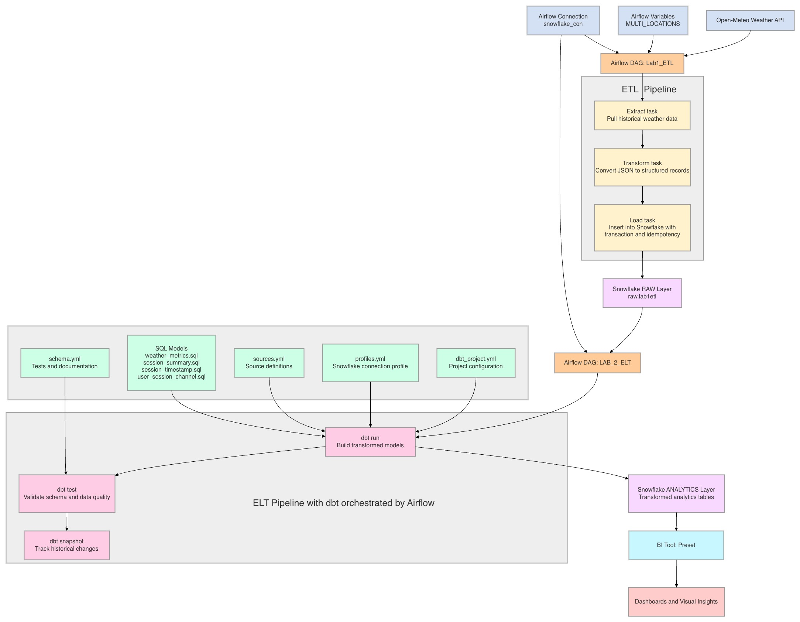
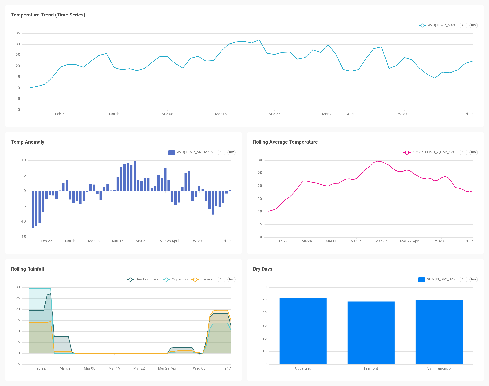

# Lab 2 – Data Pipeline & Dashboard (Weather Analytics)

## Overview
This lab builds an end-to-end data pipeline using **Airflow, dbt, and Preset** to process and visualize weather data. The pipeline automates data ingestion, transformation, and analysis, enabling insights into temperature trends, rainfall patterns, and anomalies across multiple cities.

---

## Technologies Used
- **Airflow** – Orchestrates workflows using DAGs  
- **dbt** – Transforms raw data into analytics-ready tables  
- **Snowflake** – Data warehouse  
- **Preset (Superset)** – Dashboard visualization  
- **Docker** – Reproducible environment  

---

## Project Workflow
### Workflow Diagram

## Airflow DAGs

Airflow DAGs are used to orchestrate the data pipeline. The workflow is defined through tasks that automate data ingestion and processing.

Key DAGs include:
- **Lab1_ETL.py** – Extracts and loads raw weather data into the `raw.lab1etl` table  
- **Lab2_ELT.py** – Triggers transformations and prepares data for analytics  

The DAG structure ensures tasks run in the correct order and allows monitoring through the Airflow UI.

## Data Transformation

The dbt model (`weather_metrics.sql`) creates derived metrics from raw weather data:

- Rolling 7-day average temperature  
- Rolling 7-day rainfall  
- Temperature anomaly  
- Dry day indicator  

These transformations allow for deeper analysis of weather patterns.

---

## Dashboard

The dashboard visualizes weather trends across multiple cities (Cupertino, Fremont, San Francisco).

### Key Visualizations:
- **Temperature Trend (Time Series)** – Daily temperature changes  
- **Rolling Average Temperature** – Smoothed trends  
- **Temperature Anomaly** – Deviations from average  
- **Rolling Rainfall** – Precipitation patterns  
- **Dry Days by City** – Comparison across locations  

### Dashboard Screenshot

---

## Filtering & Interactivity

A **time range filter** is applied to the dashboard, allowing users to:
- Select specific date ranges  
- Dynamically update all visualizations  

This enables flexible exploration of weather trends.

---

## Key Tables

- `raw.lab1etl`  - Raw weather data from ETL pipeline 
- `analytics.weather_metrics` - Transformed dataset used for dashboard 

---

## Key Takeaways

- Built an automated data pipeline using Airflow  
- Transformed data using dbt models  
- Created interactive dashboards in Preset  
- Demonstrated end-to-end data flow from ingestion to visualization  
- Ensured reproducibility using Docker  

---

## Notes

- Forecasting from Lab 1 is **not included** in this lab folder.  
- This lab focuses on **data transformation and visualization**

---

## Authors
- Sang Ah Lee
- Ananya Yallapragada